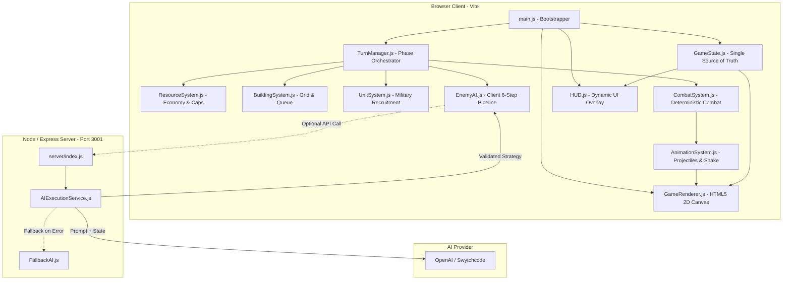

# Fortress AI 🏰

> **Adaptive Strategy Defense powered by an Intelligent Enemy AI**

[](https://nodejs.org/)
[](https://vitejs.dev/)
[](https://expressjs.com/)
[](LICENSE)

Fortress AI is a 2D, third-person, turn-based strategy defense game where the player builds, manages, and fortifies a medieval village against an evolving AI adversary. The enemy AI actively analyzes the player's tactical layout, identifies defensive vulnerabilities across directional fronts, and adapts its assault strategies over a 20-turn campaign.

---

## 🎮 What is Fortress AI?

In Fortress AI, you step into the role of a fortress commander tasked with defending your village center from escalating enemy invasions:

- **What the player controls:** You place and position directional fortifications (North, South, East, West walls and gates), build resource generators (farms, lumber mills, quarries, mines), construct defensive structures (archer towers, cannon towers), erect military barracks, recruit specialized garrison units (swordsmen, archers, knights), and upgrade buildings through 3 tiers.
- **What the player must manage:** A multi-tiered resource economy (Gold, Wood, Stone, Food), population limits, resource storage caps, and structural hitpoints across all defensive sectors.
- **What happens during a turn:** You execute your economic expansion, defensive construction, and unit recruitment during the **Player Phase**, then pass control via the **End Turn** command.
- **What the AI enemy does:** The enemy executes an automated **6-step strategic pipeline** (`SCAN` → `EVALUATE` → `PLAN` → `SCORE` → `EXECUTE` → `LEARN`), pinpointing your weakest defensive direction, calculating threat scores, formulating an attack composition, launching the assault, and updating its internal memory based on combat outcomes.
- **Why decisions have consequences:** Over-investing in economy leaves your walls under-defended; over-fortifying a single wall prompts the AI to flank around unprotected sectors or deploy specialized siege engines; failing to maintain garrison units leaves towers vulnerable to suppression.

---

## 🎯 Problem Statement — Trial 3

**Trial 3: Strategy & Simulation** requires building a **2D, third-person, turn-based strategy game** featuring:
- Resource management and economy
- Inventory, storage, and capacity scaling
- Construction and structural progression
- Multi-tier upgrades
- Directional defense networks
- AI-controlled, strategic enemy attacks

### The Strategic Challenge
Most strategy defense games rely on predetermined waves with hardcoded spawn routes. Fortress AI solves this by introducing dynamic adversarial decision-making: the enemy perceives structural durability, tower coverage, and unit distribution, dynamically choosing between frontal assaults, directional wall breaches, tower suppression strikes, resource raids, or siege bombardments.

---

## 💡 Our Solution

Fortress AI addresses Trial 3 with a unified, deterministic game engine paired with an adaptive AI decision engine:

1. **Four-Resource Economic Engine:** Gold, Wood, Stone, and Food generate per turn based on town center bonuses and active resource buildings. Storage facilities expand resource capacities.
2. **Directional Fortress Construction:** Walls, gates, and towers are positioned along village perimeters. The engine tracks separate health pools and armor ratings for Northern, Southern, Eastern, and Western walls.
3. **Adaptive Enemy AI:** The AI evaluates defense vectors on each turn, adapts unit compositions (Melee, Ranged, Siege), targets weak links, and remembers failed attack vectors to prevent repetitive exploitation.
4. **Deterministic Combat System with Controlled Variance:** Damage formulas account for base damage, building tier multipliers, armor mitigation formulas, and directional wall breaches, ensuring balanced and reproducible gameplay.
5. **Real-time Tactical Visualization:** A Canvas-based renderer renders custom-generated sprites, projectile flight paths (arrows, cannonballs), particle explosions, wall breaches, and screen shake.

---

## ⭐ Key Features

- **Turn-Based Strategy Loop:** 20-turn survival campaign with distinct Player, AI Analysis, Attack, Combat Resolution, and Income phases.
- **4-Tier Resource Economy:** Manage Gold, Wood, Stone, and Food with dynamic income calculations and storage capacity caps.
- **Grid Placement & Construction Queue:** 20×16 grid map with village zone constraints, placement validation, and turn-based construction timers.
- **Directional Defenses:** North, South, East, and West walls and gates with independent HP pools, armor values, and breach detection.
- **Building Upgrade System:** 3-tier upgrade paths for all structures (Town Center, Walls, Archer Towers, Cannon Towers, Barracks, Resource Camps, Storage).
- **Unit Recruitment & Defense Phase:** Recruit Swordsmen, Archers, and Knights from Barracks to counter-attack invading forces during combat.
- **6-Step AI Decision Pipeline:** Live visual tracking through `SCAN` → `EVALUATE` → `PLAN` → `SCORE` → `EXECUTE` → `LEARN`.
- **Hybrid AI Strategy Engine:** Supports LLM-assisted tactical reasoning via OpenAI integration with guaranteed deterministic Fallback AI.
- **Collapsible Enemy Intelligence Drawer & Mini AI HUD:** Collapsible right-hand drawer detailing threat levels, target fronts, predicted strategies, confidence meters, and AI memory.
- **Combat Simulation & Animation System:** Animated projectile trajectories, impact bursts, directional wall collapse effects, and camera shake.
- **Comprehensive Battle Log:** Filtered event stream logging economic yields, construction completions, AI decisions, and combat losses.
- **Deterministic Validation & AI Disclosure:** In-game transparency modal explaining deterministic simulation vs. AI reasoning separation.

---

## 🧠 AI System

The Enemy AI operates on a structured **6-stage pipeline** executing every turn once active invasions commence on Turn 3:

```
┌─────────┐     ┌────────────┐     ┌──────────┐     ┌───────────┐     ┌───────────┐     ┌─────────┐
│ 1. SCAN │ ──> │ 2.EVALUATE │ ──> │ 3. PLAN  │ ──> │ 4. SCORE  │ ──> │ 5.EXECUTE │ ──> │ 6.LEARN │
└─────────┘     └────────────┘     └──────────┘     └───────────┘     └───────────┘     └─────────┘
```

### Pipeline Breakdown

| Stage | Data Evaluated | Execution Type | Output Generated |
| :--- | :--- | :--- | :--- |
| **1. SCAN** | Wall HP per direction, active tower coordinates, player garrison count, resource camps, turn number, current enemy army. | Deterministic Engine | Comprehensive JSON state snapshot (`toAISnapshot()`). |
| **2. EVALUATE** | Directional weakness percentage ($1 - \frac{\text{HP}}{\text{MaxHP}}$), tower overlap per sector, garrison density, resource vulnerability. | Deterministic Engine | Sector threat ratings, vulnerability scores, and player tactical profile (`defensive`, `aggressive`, `economic`, `balanced`). |
| **3. PLAN** | Predefined strategy candidate vectors (`North Assault`, `South Assault`, `East Wall Breach`, `West Wall Breach`, `Resource Raid`, `Tower Suppression`, `Siege Assault`, `Diversionary`). | Deterministic / LLM | Candidate strategy objects with tailored unit mixes (`enemy_melee`, `enemy_ranged`, `enemy_siege`). |
| **4. SCORE** | Weighted scoring against target weakness ($w=3.0$), expected damage ($w=2.0$), route accessibility ($w=1.0$), estimated losses ($w=-2.5$), and history penalties ($w=-1.5\times\text{failures}$). | Deterministic / LLM | Ranked strategy candidate list with calculated confidence percentage ($0\% - 100\%$). |
| **5. EXECUTE** | Top-ranked strategy selection and target confirmation. | Deterministic Engine | Final attack order dispatched to `CombatSystem` and logged to Battle Log. |
| **6. LEARN** | Combat outcome data: damage dealt, player buildings destroyed, walls breached, enemy casualties. | Deterministic Memory | Updates `aiMemory` history (last 5 turns) and adjusts strategy weights dynamically. |

### Clear Separation of Responsibilities

- **AI / LLM Responsibilities:** High-level strategic reasoning, selecting attack vectors based on perceived vulnerabilities, optimizing unit deployment ratios, and generating tactical rationale.
- **Deterministic Game-Engine Responsibilities:** Combat resolution math, armor mitigation, resource deduction, construction queues, legal placement validation, hitpoint deduction, and win/loss state enforcement.

---

## 🔌 Swytchcode Integration

Fortress AI integrates an Express backend service configured to route strategic analysis through Swytchcode and OpenAI, backed by a deterministic fallback engine.

### Architecture Flow

```
   ┌────────────────────────────────────────────────────────┐
   │                   Player (Browser)                     │
   └───────────────────────────┬────────────────────────────┘
                               │ 1. End Turn Event
                               ▼
   ┌────────────────────────────────────────────────────────┐
   │                 GameState (Client)                     │
   │           Serializes State via toAISnapshot()          │
   └───────────────────────────┬────────────────────────────┘
                               │ 2. POST /api/ai/strategy
                               ▼
   ┌────────────────────────────────────────────────────────┐
   │             AIExecutionService (Server)                │
   │               Swytchcode / OpenAI Layer                │
   └───────────────┬────────────────────────┬───────────────┘
                   │                        │
  [If LLM Ready]   │                        │ [If Fallback / Offline]
                   ▼                        ▼
      ┌────────────────────────┐   ┌────────────────────────┐
      │   OpenAI GPT-4o-mini   │   │     FallbackAI.js      │
      │   (JSON Structured)    │   │ (Deterministic Scorer) │
      └────────────┬───────────┘   └────────────┬───────────┘
                   │                            │
                   └───────────┬────────────────┘
                               │ 3. Structured JSON Response
                               ▼
   ┌────────────────────────────────────────────────────────┐
   │        Schema Validation & Normalization               │
   │   (Validates strategy ID, target, and unit mix sums)   │
   └───────────────────────────┬────────────────────────────┘
                               │ 4. Validated Decision
                               ▼
   ┌────────────────────────────────────────────────────────┐
   │           CombatSystem / TurnManager (Client)          │
   │         Executes Attack & Updates Game State           │
   └────────────────────────────────────────────────────────┘
```

### Integration Details

1. **Initialization:** Handled in [`server/index.js`](file:///d:/Trial%203/server/index.js) and [`server/ai/AIExecutionService.js`](file:///d:/Trial%203/server/ai/AIExecutionService.js).
2. **Configuration:** Controlled via `.env` (`OPENAI_API_KEY`, `PORT`, `ENABLE_LLM_AI`).
3. **Endpoint:** `POST /api/ai/strategy` receives the serialized game state.
4. **Structured JSON Output:** The system prompt enforces strict JSON output containing `strategy`, `target`, `unit_mix`, `reason`, and `confidence`.
5. **Validation Layer:** `AIExecutionService._validateStrategy()` enforces strategy whitelists, clamps direction inputs to valid bounds (`north`, `south`, `east`, `west`), and normalizes unit ratios to sum to $1.0$.
6. **Graceful Fallback:** If the network request, Swytchcode proxy, or OpenAI API key is unavailable, `FallbackAI.js` instantly scores candidates deterministically with zero interruption to gameplay.

---

## 🏗️ System Architecture



---

## 🎮 Gameplay Loop

```
┌─────────────────────────────────────────────────────────────┐
│ 1. PLAYER TURN (Phase: 'player')                            │
│    • Place economic, defensive, or military buildings       │
│    • Recruit garrison units at Barracks                     │
│    • Upgrade existing structures or repair damaged walls    │
└──────────────────────────────┬──────────────────────────────┘
                               │ Click 'END TURN' (or Space/Enter)
                               ▼
┌─────────────────────────────────────────────────────────────┐
│ 2. TURN END PROCESSING                                      │
│    • Advance building construction queues                   │
│    • Apply 10% garrison unit natural healing                │
│    • Generate turn-scaled enemy reinforcements              │
└──────────────────────────────┬──────────────────────────────┘
                               │
                               ▼
┌─────────────────────────────────────────────────────────────┐
│ 3. AI ANALYSIS & ATTACK (Turns 3+)                          │
│    • Execute 6-Step Pipeline (Scan → Evaluate → Plan...)    │
│    • Select optimal assault vector & unit mix               │
│    • Animate incoming attack banner                         │
└──────────────────────────────┬──────────────────────────────┘
                               │
                               ▼
┌─────────────────────────────────────────────────────────────┐
│ 4. COMBAT RESOLUTION (Deterministic Engine)                 │
│    • Phase A: Defensive Towers Auto-Fire (Priority Targets) │
│    • Phase B: Player Units Intercept & Counter-Attack       │
│    • Phase C: Invading Enemies Attack Walls / Buildings     │
│    • Check for directional wall breaches & Town Center HP   │
└──────────────────────────────┬──────────────────────────────┘
                               │
                               ▼
┌─────────────────────────────────────────────────────────────┐
│ 5. STATE RESOLUTION & INCOME                                │
│    • AI learns from combat outcome & updates memory         │
│    • Check Game Over (Town Center destroyed = Defeat)       │
│    • Check Victory (Survived 20 turns = Victory)            │
│    • Collect resource income based on active buildings      │
│    • Advance Turn counter → Return to Step 1                │
└─────────────────────────────────────────────────────────────┘
```

---

## 🧱 Game Systems

### 1. `GameState.js`
The centralized store managing:
- Turn counters, phases, resource balances, resource caps, income tallies.
- Placed building instances with coordinates, HP, levels, and construction timers.
- Player units, directional wall segments, AI memory logs, and game statistics.
- Event emission (`on`, `off`, `emit`) for decoupled system updates.

### 2. `TurnManager.js`
Coordinates turn phase transitions, triggers build queue progress, invokes enemy reinforcement scaling, calls the AI decision pipeline, resolves combat, and evaluates win/loss conditions.

### 3. `ResourceSystem.js`
Handles economic recalculations:
- Base yields: Gold (+25), Wood (+15), Stone (+10), Food (+15).
- Structure bonuses from Resource Camps and Town Center upgrades.
- Storage facility capacity scaling (Base caps: 2000 Gold, 1500 Wood, 1500 Stone, 1000 Food).

### 4. `BuildingSystem.js`
Controls grid spatial validation:
- Enforces 20×16 map boundaries and prevents building over water or existing structures.
- Restricts walls and gates to village perimeter coordinates.
- Manages multi-turn construction queues and structural repairs.

### 5. `UnitSystem.js`
Manages garrison forces:
- Validates recruitment against food/gold costs, population caps, and active Barracks.
- Handles unit HP pools, armor mitigation, inter-turn healing, and casualty cleanup.

### 6. `CombatSystem.js`
Implements the three-stage combat simulation:
- **Tower Auto-Fire:** Towers engage approaching forces using target priority (`Siege` → `Melee` → `Ranged`). Cannon towers deal $40\%$ splash damage.
- **Unit Defense:** Garrison units intercept enemies, applying damage modifiers and receiving counter-attacks.
- **Building Assault:** Surviving enemies attack designated directional walls or structures. Wall breaches grant $+50\%$ bonus damage to interior targets.
- Damage formula:
  $$\text{Damage} = \text{BaseDamage} \times \text{LevelMultiplier} \times \text{TargetModifier} \times \text{Variance}_{[0.85, 1.15]}$$
  $$\text{EffectiveDamage} = \max\left(1, \text{Damage} \times \frac{100}{100 + \text{Armor}}\right)$$

### 7. `GameRenderer.js`, `SpriteSystem.js`, `ParticleSystem.js`, `AnimationSystem.js`
- **GameRenderer:** Fullscreen 2D canvas renderer drawing procedural terrain, grid overlays, buildings, garrison units, health bars, and placement ghosts.
- **SpriteSystem:** Procedural canvas sprite generation with distinct visual states per building tier and unit type.
- **ParticleSystem:** High-performance particle emitter rendering combat explosions, smoke puffs, and destruction debris.
- **AnimationSystem:** Handles projectile flight curves (arrows, cannonballs) and screen shake effects.

---

## 🖥️ User Interface

The UI provides an immersive HUD overlay that maintains maximum visibility of the battlefield:

- **Top Status Bar:** Real-time turn counter, resource counters with per-turn delta badges, and population capacity meter.
- **Collapsible Battle Log (Top-Left):** Floating event feed detailing turn events, recruitment, attacks, and wall breaches with an instant toggle button (`−` / `+`).
- **AI Mini-HUD (Top-Right):** Compact floating tactical card displaying real-time Threat Level (`LOW`, `MEDIUM`, `HIGH`, `CRITICAL`), targeted direction, predicted strategy, confidence percentage, and active AI pipeline step indicators.
- **Collapsible Enemy Intelligence Drawer (Right Side):** Slide-out drawer displaying comprehensive AI status, enemy force composition bars, directional wall vulnerability gauges, predicted strategies, and step-by-step pipeline visualization.
- **Bottom Action Panel:** Tabbed interface (`Build`, `Defense`, `Units`, `Upgrades`) showing detailed cost breakdowns, building descriptions, and the prominent **End Turn** command.
- **Phase Banners & Modals:** Non-intrusive phase banners during AI analysis and combat, complete with Game Over summary and AI Disclosure modal.

---

## 🛡️ Game Rules & Validation

1. **State Isolation:** The AI cannot directly modify player resources, teleport units, or bypass construction requirements. It submits attack orders that are strictly evaluated by the deterministic engine.
2. **Construction Rules:** Structures can only be built on valid, unoccupied grid cells within defined village borders. Walls must be placed on perimeter cells.
3. **Resource Spending Protection:** Every placement, recruitment, and upgrade undergoes strict affordability validation before state mutation.
4. **AI Schema Validation:** All strategy inputs from external services undergo schema verification, defaulting safely to standard attack formations if malformed data is received.

---

## 🤖 AI Disclosure

- **Strategic AI Engine:** Uses a 6-stage decision pipeline to evaluate defense layout and formulate attacks.
- **LLM Reasoning (Optional):** When configured, OpenAI GPT-4o-mini provides tactical strategy selection via structured JSON outputs.
- **Deterministic Simulation:** Combat damage, building construction, resource generation, and win/loss rules are 100% deterministic and enforced by the local JavaScript engine.
- **Swytchcode Role:** Acts as the backend execution layer handling API routing, execution policies, and structured validation.
- **Offline / Fallback Mode:** The game is fully functional offline using the built-in deterministic scoring algorithm in `FallbackAI.js`.

---

## 🧪 Testing & Verification

### Verification Checklist
- [x] **Dev Server Startup:** Vite runs without build errors or asset loading failures.
- [x] **Express Backend:** Health check endpoint (`GET /api/health`) responds with server status.
- [x] **Turn Loop Execution:** Turn transition advances economy, processes build queue, and updates state.
- [x] **AI Strategy Execution:** AI pipeline triggers on Turn 3+, generating valid strategy outputs.
- [x] **Combat System:** Tower auto-fire, unit defense, wall breaches, and damage formulas execute accurately.
- [x] **Fallback Reliability:** Game operates seamlessly when LLM backend is offline.

---

## 🚀 Getting Started

### Prerequisites
- [Node.js](https://nodejs.org/) (v18.0.0 or higher)
- npm (v9.0.0 or higher)

### Installation

1. **Clone the repository:**
   ```bash
   git clone https://github.com/BigO-Debbuger/Trial-3.git
   cd Trial-3
   ```

2. **Install dependencies:**
   ```bash
   npm install
   ```

3. **Configure Environment Variables (Optional):**
   Copy the example environment file:
   ```bash
   cp .env.example .env
   ```
   *(Optional: Add your `OPENAI_API_KEY` to enable LLM-powered AI strategy)*

### Running the Application

1. **Start the Frontend Game Client:**
   ```bash
   npm run dev
   ```
   *Open [http://localhost:5173](http://localhost:5173) in your browser.*

2. **Start the Backend Server (Optional for LLM AI):**
   ```bash
   node server/index.js
   ```
   *Backend runs on [http://localhost:3001](http://localhost:3001).*

---

## 🔐 Environment Variables

Create a `.env` file in the root directory:

```env
# OpenAI API Key for LLM strategy reasoning (optional)
OPENAI_API_KEY=your_openai_api_key_here

# Server Port
PORT=3001

# Enable / Disable LLM AI (set to false for deterministic-only)
ENABLE_LLM_AI=true
```

---

## 📁 Project Structure

```
Trial 3/
├── index.html                     # Main HTML template & HUD markup
├── package.json                   # Dependencies & build scripts
├── vite.config.js                 # Vite configuration with /api proxy
├── .env.example                   # Environment configuration template
│
├── server/                        # Backend Service
│   ├── index.js                   # Express server & API routes
│   └── ai/
│       ├── AIExecutionService.js  # OpenAI / Swytchcode strategy service
│       └── FallbackAI.js          # Deterministic scoring engine
│
├── src/                           # Client-Side Application
│   ├── main.js                    # Main entry point & initialization
│   ├── ai/
│   │   └── EnemyAI.js             # Client 6-step AI strategy pipeline
│   ├── data/
│   │   ├── balancing.js           # Balance constants, combat formulas & strategies
│   │   ├── buildings.js           # Building definitions, costs & upgrade tiers
│   │   └── units.js               # Player & enemy unit stats & modifiers
│   ├── game/
│   │   ├── BuildingSystem.js      # Placement, upgrading & construction queue
│   │   ├── CombatSystem.js        # Deterministic combat resolution & formulas
│   │   ├── GameState.js           # Single source of truth game store
│   │   ├── ResourceSystem.js      # Income generation, storage caps & population
│   │   ├── TurnManager.js         # Turn loop orchestrator
│   │   └── UnitSystem.js          # Military recruitment & unit management
│   ├── renderer/
│   │   ├── AnimationSystem.js     # Projectile arcs & screen shake
│   │   ├── GameRenderer.js        # 2D HTML5 canvas renderer
│   │   ├── ParticleSystem.js      # Combat particles & explosion effects
│   │   └── SpriteSystem.js        # Procedural sprite generator
│   ├── styles/
│   │   └── main.css               # Glassmorphism UI styling & layout
│   └── ui/
│       └── HUD.js                 # HUD controller, drawers & event bindings
```

---

## 🎥 Demo

- **Demo Video:** [Loom Demo Link](https://www.loom.com/)
- **Live Prototype:** [Deployment Link](https://fortress-ai.vercel.app/)
- **Repository:** [GitHub Repository](https://github.com/BigO-Debbuger/Trial-3)

---

## 🏆 Hackathon Alignment

Fortress AI directly fulfills all criteria for **Trial 3 (Strategy & Simulation)**:
- **2D & Third-Person:** Rendered on an HTML5 canvas with a top-down isometric tactical perspective.
- **Turn-Based Loop:** Discrete player decisions followed by structured AI deliberation and combat phases.
- **Multi-Tier Resource Economy:** Active production and management of Gold, Wood, Stone, and Food.
- **Inventory & Capacity Limits:** Storage buildings govern maximum resource stockpiles.
- **Construction & Upgrades:** Multi-tier progression for defensive, economic, and military infrastructure.
- **Directional Defenses:** Directional wall and gate network protecting against targeted incursions.
- **Intelligent Enemy Strategy:** 6-step AI decision engine that analyzes defense gaps and adapts attack vectors.
- **Robust Integration & Fallback:** Hybrid architecture leveraging LLM reasoning with an offline deterministic fallback.

---

## 🔮 Future Extensions

- [ ] **Multi-Front Simultaneous Invasions:** Splitting enemy armies across multiple directions simultaneously in later turns.
- [ ] **Hero Units & Skill Trees:** Customizable commander units with activatable defensive aura abilities.
- [ ] **Fog of War & Scouting Mechanics:** Deploying scout units beyond village walls to detect enemy staging grounds.
- [ ] **Map Editor & Custom Campaigns:** User-created terrain layouts, custom wave configurations, and community scenarios.
