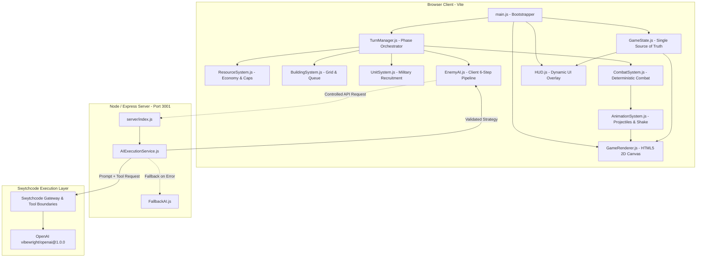

# Fortress AI 🏰

> **Two-Sided Turn-Based Strategy & Simulation powered by Adaptive AI & Swytchcode**

[](https://nodejs.org/)
[](https://vitejs.dev/)
[](https://expressjs.com/)
[](https://swytchcode.com/)
[](LICENSE)

Fortress AI is a two-sided, turn-based strategy game where players build, defend, and attack enemy empires while an adaptive AI actively responds to their decisions. Players strategically deploy units, target enemy structures, manage resources, construct defenses, and adapt their tactics as the battlefield evolves. The enemy AI can both defend against player assaults and launch its own offensive attacks, creating a dynamic war rather than a one-directional combat system.

Swytchcode is integrated as the controlled execution layer between the AI decision-making system and the game's capabilities. Instead of allowing the AI to directly modify game state, Swytchcode exposes controlled game operations/tools for inspecting the battlefield, evaluating threats, selecting targets, and executing strategic actions. This allows AI decisions to pass through a structured, validated execution layer with appropriate constraints before being applied by the game engine. The result is a safer and more reliable AI architecture where the AI can reason strategically while the deterministic game engine remains the source of truth.

Together, adaptive AI, tactical combat, resource management, and Swytchcode-powered tool execution create a living two-sided battlefield where both the player and AI attack, defend, learn, and adapt.

---

## 🎮 What is Fortress AI?

In Fortress AI, you step into the role of a fortress commander tasked with defending your village center while waging an active war against an escalating enemy empire:

- **What the player controls:** You place and position directional fortifications (North, South, East, West walls and gates), build resource generators (farms, lumber mills, quarries, mines), construct defensive structures (archer towers, cannon towers), erect military barracks, recruit specialized garrison & assault units (swordsmen, archers, knights, siege rams), launch expeditions against enemy strongholds, and upgrade buildings through 3 tiers.
- **What the player must manage:** A multi-tiered resource economy (Gold, Wood, Stone, Food), population limits, resource storage caps, and structural hitpoints across all defensive sectors.
- **What happens during a turn:** You execute economic expansion, defensive construction, unit recruitment, and launch targeted empire assaults during the **Player Phase**, then pass control via the **End Turn** command.
- **What the AI enemy does:** The enemy executes an automated **6-step strategic pipeline** (`SCAN` → `EVALUATE` → `PLAN` → `SCORE` → `EXECUTE` → `LEARN`), pinpointing your weakest defensive direction, calculating threat scores, formulating an attack composition, and updating its internal memory. Furthermore, when the player attacks the enemy empire, the AI evaluates the incoming strike and deploys dynamic defensive doctrines (`HOLD`, `REINFORCE`, `COUNTERATTACK`, `REDIRECT`).
- **Why decisions have consequences:** Over-investing in economy leaves your walls under-defended; over-fortifying a single wall prompts the AI to flank around unprotected sectors or deploy specialized siege engines; failing to maintain garrison units leaves towers vulnerable to suppression.

---

## 🎯 Problem Statement — Trial 3

**Trial 3: Strategy & Simulation** requires building a **2D, third-person, turn-based strategy game** featuring:
- Resource management and economy
- Inventory, storage, and capacity scaling
- Construction and structural progression
- Multi-tier upgrades
- Directional defense networks
- AI-controlled, strategic enemy attacks
- Dynamic consequence mechanics where player decisions directly shape outcomes

### The Strategic Challenge
Most strategy defense games rely on predetermined waves with hardcoded spawn routes. Fortress AI solves this by introducing dynamic adversarial decision-making: the enemy perceives structural durability, tower coverage, unit distribution, and economic targets, dynamically choosing between frontal assaults, directional wall breaches, tower suppression strikes, resource raids, or siege bombardments, while mounting intelligent defenses when attacked.

---

## 💡 Our Solution

Fortress AI addresses Trial 3 with a unified, deterministic game engine paired with an adaptive AI decision engine operating through Swytchcode:

1. **Four-Resource Economic Engine:** Gold, Wood, Stone, and Food generate per turn based on town center bonuses and active resource buildings. Storage facilities expand resource capacities.
2. **Directional Fortress Construction:** Walls, gates, and towers are positioned along village perimeters. The engine tracks separate health pools and armor ratings for Northern, Southern, Eastern, and Western walls.
3. **Two-Sided Combat & Adaptive AI:** The AI evaluates defense vectors on each turn, adapts unit compositions (Melee, Ranged, Siege), targets weak links, remembers past combat outcomes, and deploys tactical countermeasures against player invasions.
4. **Deterministic Combat System with Controlled Variance:** Damage formulas account for base damage, building tier multipliers, armor mitigation formulas, and directional wall breaches, ensuring balanced and reproducible gameplay.
5. **Real-time Tactical Visualization:** A Canvas-based renderer displays procedural sprites, projectile flight paths (arrows, cannonballs), particle explosions, wall breaches, and screen shake.

---

## ⭐ Key Features

- **Two-Sided Turn-Based Strategy Loop:** 20-turn campaign with discrete Player, Empire Assault, AI Analysis, Attack, Combat Resolution, and Income phases.
- **Controlled Swytchcode Execution Layer:** Structured tool execution pipeline for safe, auditable, and validated AI strategic actions.
- **4-Tier Resource Economy:** Manage Gold, Wood, Stone, and Food with dynamic income calculations and storage capacity caps.
- **Grid Placement & Construction Queue:** 20×16 grid map with village zone constraints, placement validation, and turn-based construction timers.
- **Directional Defenses:** North, South, East, and West walls and gates with independent HP pools, armor values, and breach detection.
- **Building Upgrade System:** 3-tier upgrade paths for all structures (Town Center, Walls, Archer Towers, Cannon Towers, Barracks, Resource Camps, Storage).
- **Unit Recruitment & Combat Phase:** Recruit Swordsmen, Archers, Knights, and Siege Rams from Barracks for home defense and offensive strikes.
- **6-Step AI Decision Pipeline:** Live visual tracking through `SCAN` → `EVALUATE` → `PLAN` → `SCORE` → `EXECUTE` → `LEARN`.
- **Dynamic AI Defensive Doctrines:** AI reacts to player invasions by activating `HOLD`, `REINFORCE`, `COUNTERATTACK`, or `REDIRECT`.
- **Collapsible Enemy Intelligence Drawer & Mini AI HUD:** Collapsible drawer detailing threat levels, target fronts, predicted strategies, confidence meters, and AI memory.
- **Deterministic Validation & AI Disclosure:** In-game transparency modal explaining deterministic simulation vs. AI reasoning separation.

---

## 🔌 Swytchcode Integration

Swytchcode serves as the **controlled execution layer** between the AI reasoning system and the deterministic game engine.

### Why Swytchcode?

Directly coupling an AI/LLM to game state mutations introduces significant security and stability risks, including hallucinations, illegal resource mutations, out-of-bounds actions, and non-deterministic state corruption. Swytchcode solves this by providing:

1. **Controlled Game Operations / Tools:** The AI interacts with the game exclusively through strictly defined, schema-validated tools.
2. **Deterministic Source of Truth:** Game rules, combat formulas, resource costs, and spatial placements remain 100% deterministic inside the game engine.
3. **Execution Guardrails:** Boundaries prevent the AI from bypassing game rules, forging unit counts, or teleporting across sectors.
4. **Auditable Decision Pipeline:** All AI tool invocations, candidate evaluations, and tactical rationales are logged in real-time.

```
┌─────────────────────────────────────────────────────────────────────────────────┐
│                           AI REASONING SYSTEM (LLM)                             │
│                  OpenAI GPT-4o-mini via Swytchcode Integration                  │
└──────────────────────────────────────┬──────────────────────────────────────────┘
                                       │ (Requests Tools & Generates Actions)
                                       ▼
┌─────────────────────────────────────────────────────────────────────────────────┐
│                    SWYTCHCODE CONTROLLED EXECUTION LAYER                         │
│   • Schema Validation        • Permission Boundaries    • Parameter Clamping    │
│   • Tool Execution Gateway   • Rate Limiting            • Deterministic Fallback │
├─────────────────────────────────────────────────────────────────────────────────┤
│  Controlled Tools Exposed to AI:                                                │
│   1. inspect_battlefield(state)          → Reads directional HP, towers, units  │
│   2. evaluate_threats(sector)            → Computes vulnerability & risk        │
│   3. select_offensive_strategy(target)   → Formulates attack vector & unit mix  │
│   4. execute_defensive_doctrine(context) → Selects HOLD / REINFORCE / COUNTER   │
└──────────────────────────────────────┬──────────────────────────────────────────┘
                                       │ (Validated & Clamped Operations)
                                       ▼
┌─────────────────────────────────────────────────────────────────────────────────┐
│                         DETERMINISTIC GAME ENGINE                               │
│              GameState.js • CombatSystem.js • TurnManager.js                    │
│   (Source of Truth: Resolves combat math, enforces costs, updates HP/state)     │
└─────────────────────────────────────────────────────────────────────────────────┘
```

### Swytchcode Tooling Setup & CLI

The project is configured using Swytchcode integration tooling:

```bash
# 1. Add the OpenAI integration package to tooling.json
swytchcode add integration vibewright/openai@1.0.0

# 2. Bootstrap dependencies and lockfiles
swytchcode bootstrap

# 3. List installed integrations and capabilities
swytchcode list

# 4. Verify system health and permissions
swytchcode doctor
```

#### Tooling Configuration (`tooling.json`)
```json
{
  "integrations": {
    "vibewright/openai@1.0.0": {
      "version": "1.0.0"
    }
  }
}
```

### Controlled Execution Flow

```
   ┌────────────────────────────────────────────────────────┐
   │                   Player (Browser)                     │
   └───────────────────────────┬────────────────────────────┘
                               │ 1. End Turn / Attack Action
                               ▼
   ┌────────────────────────────────────────────────────────┐
   │                 GameState (Client)                     │
   │           Serializes State via toAISnapshot()          │
   └───────────────────────────┬────────────────────────────┘
                               │ 2. POST /api/ai/strategy (or /defend)
                               ▼
   ┌────────────────────────────────────────────────────────┐
   │             AIExecutionService (Server)                │
   │               Swytchcode / OpenAI Layer                │
   └───────────────┬────────────────────────┬───────────────┘
                   │                        │
  [If LLM Ready]   │                        │ [If Fallback / Offline]
                   ▼                        ▼
      ┌────────────────────────┐   ┌────────────────────────┐
      │   OpenAI GPT-4o-mini   │   │     FallbackAI.js      │
      │   (JSON Structured)    │   │ (Deterministic Scorer) │
      └────────────┬───────────┘   └────────────┬───────────┘
                   │                            │
                   └───────────┬────────────────┘
                               │ 3. Structured JSON Response
                               ▼
   ┌────────────────────────────────────────────────────────┐
   │        Schema Validation & Normalization               │
   │   (Validates strategy ID, target, and unit mix sums)   │
   └───────────────────────────┬────────────────────────────┘
                               │ 4. Validated Decision
                               ▼
   ┌────────────────────────────────────────────────────────┐
   │           CombatSystem / TurnManager (Client)          │
   │         Executes Attack & Updates Game State           │
   └────────────────────────────────────────────────────────┘
```

### Integration Endpoints & Responsibilities

1. **Offensive Strategy (`POST /api/ai/strategy`):**
   - Receives snapshot of player base (wall HP per direction, tower coordinates, garrison count, resource camps, turn history).
   - Prompts the AI to select the optimal offensive vector (`north_assault`, `south_assault`, `east_wall_breach`, `west_wall_breach`, `resource_raid`, `tower_suppression`, `siege_assault`, `diversionary`).
   - Normalizes unit deployment ratios (`enemy_melee`, `enemy_ranged`, `enemy_siege`) so their sum equals $1.0$.

2. **Defensive Response (`POST /api/ai/defend`):**
   - Receives context when the player launches an assault against the enemy empire (incoming unit counts, targeted structure, deployed route).
   - AI evaluates the attack and selects a defensive countermeasure:
     - `HOLD`: Fortifies structural positions (+35% building defense).
     - `REINFORCE`: Rushes emergency garrison defenders to threatened assets.
     - `COUNTERATTACK`: Deploys shock melee units (+75% counter damage) against vulnerable siege rams or archers.
     - `REDIRECT`: Shifts marksmen to establish crossfire choke points.

3. **Validation & Normalization Layer:**
   - `AIExecutionService._validateStrategy()` enforces strategy whitelists, clamps direction inputs to valid bounds (`north`, `south`, `east`, `west`), and normalizes unit ratios.
   - `AIExecutionService._validateDefensiveStrategy()` restricts doctrines to permitted enums and clamps defender counts.

4. **Guaranteed Offline Fallback:**
   - If the network request or OpenAI API key is unavailable, `FallbackAI.js` executes deterministic heuristic scoring instantly with zero gameplay interruption.

---

## 🧠 AI Decision Pipeline

The Enemy AI operates on a structured **6-stage pipeline** executing every turn once active invasions commence on Turn 3:

```
┌─────────┐     ┌────────────┐     ┌──────────┐     ┌───────────┐     ┌───────────┐     ┌─────────┐
│ 1. SCAN │ ──> │ 2.EVALUATE │ ──> │ 3. PLAN  │ ──> │ 4. SCORE  │ ──> │ 5.EXECUTE │ ──> │ 6.LEARN │
└─────────┘     └────────────┘     └──────────┘     └───────────┘     └───────────┘     └─────────┘
```

| Stage | Data Evaluated | Execution Type | Output Generated |
| :--- | :--- | :--- | :--- |
| **1. SCAN** | Wall HP per direction, active tower coordinates, player garrison count, resource camps, turn number, current enemy army. | Deterministic Engine | Comprehensive JSON state snapshot (`toAISnapshot()`). |
| **2. EVALUATE** | Directional weakness percentage ($1 - \frac{\text{HP}}{\text{MaxHP}}$), tower overlap per sector, garrison density, resource vulnerability. | Deterministic Engine | Sector threat ratings, vulnerability scores, and player tactical profile (`defensive`, `aggressive`, `economic`, `balanced`). |
| **3. PLAN** | Predefined strategy candidate vectors (`North Assault`, `South Assault`, `East Wall Breach`, `West Wall Breach`, `Resource Raid`, `Tower Suppression`, `Siege Assault`, `Diversionary`). | Deterministic / LLM | Candidate strategy objects with tailored unit mixes (`enemy_melee`, `enemy_ranged`, `enemy_siege`). |
| **4. SCORE** | Weighted scoring against target weakness ($w=3.0$), expected damage ($w=2.0$), route accessibility ($w=1.0$), estimated losses ($w=-2.5$), and history penalties ($w=-1.5\times\text{failures}$). | Deterministic / LLM | Ranked strategy candidate list with calculated confidence percentage ($0\% - 100\%$). |
| **5. EXECUTE** | Top-ranked strategy selection and target confirmation via Swytchcode layer. | Deterministic Engine | Final attack order dispatched to `CombatSystem` and logged to Battle Log. |
| **6. LEARN** | Combat outcome data: damage dealt, player buildings destroyed, walls breached, enemy casualties. | Deterministic Memory | Updates `aiMemory` history (last 5 turns) and adjusts strategy weights dynamically. |

---

## 🏗️ System Architecture



---

## 🎮 Gameplay Loop

```
┌─────────────────────────────────────────────────────────────┐
│ 1. PLAYER TURN (Phase: 'player')                            │
│    • Place economic, defensive, or military buildings       │
│    • Recruit garrison units or launch empire assault forces │
│    • Upgrade existing structures or repair damaged walls    │
└──────────────────────────────┬──────────────────────────────┘
                               │ Click 'END TURN' (or Space/Enter)
                               ▼
┌─────────────────────────────────────────────────────────────┐
│ 2. TURN END PROCESSING                                      │
│    • Advance building construction queues                   │
│    • Apply 10% garrison unit natural healing                │
│    • Generate turn-scaled enemy reinforcements              │
└──────────────────────────────┬──────────────────────────────┘
                               │
                               ▼
┌─────────────────────────────────────────────────────────────┐
│ 3. AI STRATEGY & SWYTCHCODE EXECUTION (Turns 3+)            │
│    • Swytchcode controlled tool inspection & threat score   │
│    • Select optimal assault vector & normalized unit mix    │
│    • Animate incoming attack banner & tactical alert        │
└──────────────────────────────┬──────────────────────────────┘
                               │
                               ▼
┌─────────────────────────────────────────────────────────────┐
│ 4. COMBAT RESOLUTION (Deterministic Engine)                 │
│    • Phase A: Defensive Towers Auto-Fire (Priority Targets) │
│    • Phase B: Player Units Intercept & Counter-Attack       │
│    • Phase C: Invading Enemies Attack Walls / Buildings     │
│    • Check for directional wall breaches & Town Center HP   │
└──────────────────────────────┬──────────────────────────────┘
                               │
                               ▼
┌─────────────────────────────────────────────────────────────┐
│ 5. STATE RESOLUTION & INCOME                                │
│    • AI learns from combat outcome & updates memory         │
│    • Check Game Over (Town Center destroyed = Defeat)       │
│    • Check Victory (Survived 20 turns / Defeated Empire)    │
│    • Collect resource income based on active buildings      │
│    • Advance Turn counter → Return to Step 1                │
└─────────────────────────────────────────────────────────────┘
```

---

## 🧱 Game Systems

### 1. `GameState.js`
The centralized store managing:
- Turn counters, phases, resource balances, resource caps, income tallies.
- Placed building instances with coordinates, HP, levels, and construction timers.
- Player units, directional wall segments, AI memory logs, and game statistics.
- Event emission (`on`, `off`, `emit`) for decoupled system updates.

### 2. `TurnManager.js`
Coordinates turn phase transitions, triggers build queue progress, invokes enemy reinforcement scaling, calls the AI decision pipeline via Swytchcode, resolves combat, and evaluates win/loss conditions.

### 3. `ResourceSystem.js`
Handles economic recalculations:
- Base yields: Gold (+25), Wood (+15), Stone (+10), Food (+15).
- Structure bonuses from Resource Camps and Town Center upgrades.
- Storage facility capacity scaling (Base caps: 2000 Gold, 1500 Wood, 1500 Stone, 1000 Food).

### 4. `BuildingSystem.js`
Controls grid spatial validation:
- Enforces 20×16 map boundaries and prevents building over water or existing structures.
- Restricts walls and gates to village perimeter coordinates.
- Manages multi-turn construction queues and structural repairs.

### 5. `UnitSystem.js`
Manages military forces:
- Validates recruitment against food/gold costs, population caps, and active Barracks.
- Supports Swordsmen, Archers, Knights, and Siege Rams.
- Handles unit HP pools, armor mitigation, inter-turn healing, and casualty cleanup.

### 6. `CombatSystem.js`
Implements the deterministic combat simulation:
- **Tower Auto-Fire:** Towers engage approaching forces using target priority (`Siege` → `Melee` → `Ranged`). Cannon towers deal $40\%$ splash damage.
- **Unit Defense & Counter-Attack:** Garrison units intercept enemies, applying damage modifiers and receiving counter-attacks.
- **Building Assault:** Surviving enemies attack designated directional walls or structures. Wall breaches grant $+50\%$ bonus damage to interior targets.
- Damage formulas:
  $$\text{Damage} = \text{BaseDamage} \times \text{LevelMultiplier} \times \text{TargetModifier} \times \text{Variance}_{[0.85, 1.15]}$$
  $$\text{EffectiveDamage} = \max\left(1, \text{Damage} \times \frac{100}{100 + \text{Armor}}\right)$$

### 7. `GameRenderer.js`, `SpriteSystem.js`, `ParticleSystem.js`, `AnimationSystem.js`
- **GameRenderer:** Fullscreen 2D canvas renderer drawing procedural terrain, grid overlays, buildings, units, health bars, and placement ghosts.
- **SpriteSystem:** Procedural canvas sprite generation with distinct visual states per building tier and unit type.
- **ParticleSystem:** High-performance particle emitter rendering combat explosions, smoke puffs, and destruction debris.
- **AnimationSystem:** Handles projectile flight curves (arrows, cannonballs) and screen shake effects.

---

## 🖥️ User Interface

The UI provides an immersive HUD overlay that maintains maximum visibility of the battlefield:

- **Top Status Bar:** Real-time turn counter, resource counters with per-turn delta badges, and population capacity meter.
- **Collapsible Battle Log (Top-Left):** Floating event feed detailing turn events, recruitment, attacks, and wall breaches with an instant toggle button (`−` / `+`).
- **AI Mini-HUD (Top-Right):** Compact floating tactical card displaying real-time Threat Level (`LOW`, `MEDIUM`, `HIGH`, `CRITICAL`), targeted direction, predicted strategy, confidence percentage, and active AI pipeline step indicators.
- **Collapsible Enemy Intelligence Drawer (Right Side):** Slide-out drawer displaying comprehensive AI status, enemy force composition bars, directional wall vulnerability gauges, predicted strategies, and step-by-step pipeline visualization.
- **Bottom Action Panel:** Tabbed interface (`Build`, `Defense`, `Units`, `Upgrades`) showing detailed cost breakdowns, building descriptions, and the prominent **End Turn** command.
- **Phase Banners & Modals:** Non-intrusive phase banners during AI analysis and combat, complete with Game Over summary and AI Disclosure modal.

---

## 🛡️ Game Rules & Validation

1. **State Isolation:** The AI cannot directly modify player resources, teleport units, or bypass construction requirements. It submits strategic decisions through Swytchcode that are strictly evaluated by the deterministic engine.
2. **Construction Rules:** Structures can only be built on valid, unoccupied grid cells within defined village borders. Walls must be placed on perimeter cells.
3. **Resource Spending Protection:** Every placement, recruitment, and upgrade undergoes strict affordability validation before state mutation.
4. **AI Schema Validation:** All strategy inputs from external services undergo schema verification, defaulting safely to standard attack formations if malformed data is received.

---

## 🤖 AI Disclosure

- **Strategic AI Engine:** Uses a 6-stage decision pipeline to evaluate defense layout and formulate attacks.
- **LLM Reasoning:** OpenAI GPT-4o-mini accessed via Swytchcode integration provides tactical strategy selection via structured JSON outputs.
- **Deterministic Simulation:** Combat damage, building construction, resource generation, and win/loss rules are 100% deterministic and enforced by the local JavaScript engine.
- **Swytchcode Role:** Acts as the controlled execution layer handling API routing, tool exposure, schema validation, and execution guardrails.
- **Offline / Fallback Mode:** The game is fully functional offline using the built-in deterministic scoring algorithm in `FallbackAI.js`.

---

## 🧪 Testing & Verification

### Verification Checklist
- [x] **Dev Server Startup:** Vite runs without build errors or asset loading failures.
- [x] **Express Backend:** Health check endpoint (`GET /api/health`) responds with server status.
- [x] **Swytchcode Integration:** `tooling.json` configured with `vibewright/openai@1.0.0` integration.
- [x] **Turn Loop Execution:** Turn transition advances economy, processes build queue, and updates state.
- [x] **Two-Sided Combat:** AI strategy execution and defensive doctrine responses both function reliably.
- [x] **Combat System:** Tower auto-fire, unit defense, wall breaches, and damage formulas execute accurately.
- [x] **Fallback Reliability:** Game operates seamlessly when LLM backend is offline.

---

## 🚀 Getting Started

### Prerequisites
- [Node.js](https://nodejs.org/) (v18.0.0 or higher)
- npm (v9.0.0 or higher)
- [Swytchcode CLI](https://swytchcode.com/) (optional for managing tooling integrations)

### Installation

1. **Clone the repository:**
   ```bash
   git clone https://github.com/BigO-Debbuger/Trial-3.git
   cd Trial-3
   ```

2. **Install dependencies:**
   ```bash
   npm install
   ```

3. **Install Swytchcode Integrations (Optional):**
   ```bash
   swytchcode add integration vibewright/openai@1.0.0
   swytchcode bootstrap
   ```

4. **Configure Environment Variables:**
   Copy the example environment file:
   ```bash
   cp .env.example .env
   ```
   *(Optional: Add your `OPENAI_API_KEY` to enable LLM-powered AI strategy)*

### Running the Application

1. **Start the Frontend Game Client:**
   ```bash
   npm run dev
   ```
   *Open [http://localhost:5173](http://localhost:5173) in your browser.*

2. **Start the Backend Server (for Swytchcode / LLM AI):**
   ```bash
   node server/index.js
   ```
   *Backend runs on [http://localhost:3001](http://localhost:3001).*

---

## 🔐 Environment Variables

Create a `.env` file in the root directory:

```env
# OpenAI API Key for LLM strategy reasoning (optional)
OPENAI_API_KEY=your_openai_api_key_here

# Server Port
PORT=3001

# Enable / Disable LLM AI (set to false for deterministic-only)
ENABLE_LLM_AI=true
```

---

## 📁 Project Structure

```
Trial 3/
├── index.html                     # Main HTML template & HUD markup
├── package.json                   # Dependencies & build scripts
├── vite.config.js                 # Vite configuration with /api proxy
├── .env.example                   # Environment configuration template
├── .swytchcode/                   # Swytchcode tooling configuration
│   ├── tooling.json               # Integration manifest (vibewright/openai@1.0.0)
│   └── workspace.json             # Swytchcode workspace definition
│
├── server/                        # Backend Service
│   ├── index.js                   # Express server & API routes
│   └── ai/
│       ├── AIExecutionService.js  # Swytchcode / OpenAI strategy service
│       └── FallbackAI.js          # Deterministic scoring engine
│
├── src/                           # Client-Side Application
│   ├── main.js                    # Main entry point & initialization
│   ├── ai/
│   │   └── EnemyAI.js             # Client 6-step AI strategy pipeline
│   ├── data/
│   │   ├── balancing.js           # Balance constants, combat formulas & strategies
│   │   ├── buildings.js           # Building definitions, costs & upgrade tiers
│   │   └── units.js               # Player & enemy unit stats & modifiers
│   ├── game/
│   │   ├── BuildingSystem.js      # Placement, upgrading & construction queue
│   │   ├── CombatSystem.js        # Deterministic combat resolution & formulas
│   │   ├── GameState.js           # Single source of truth game store
│   │   ├── ResourceSystem.js      # Income generation, storage caps & population
│   │   ├── TurnManager.js         # Turn loop orchestrator
│   │   └── UnitSystem.js          # Military recruitment & unit management
│   ├── renderer/
│   │   ├── AnimationSystem.js     # Projectile arcs & screen shake
│   │   ├── GameRenderer.js        # 2D HTML5 canvas renderer
│   │   ├── ParticleSystem.js      # Combat particles & explosion effects
│   │   └── SpriteSystem.js        # Procedural sprite generator
│   ├── styles/
│   │   └── main.css               # Glassmorphism UI styling & layout
│   └── ui/
│       └── HUD.js                 # HUD controller, drawers & event bindings
```

---

## 🎥 Demo

- **Demo Video:** [Loom Demo Link](https://www.loom.com/)
- **Live Prototype:** [Deployment Link](https://fortress-ai.vercel.app/)
- **Repository:** [GitHub Repository](https://github.com/BigO-Debbuger/Trial-3)

---

## 🏆 Hackathon Alignment

Fortress AI directly fulfills all criteria for **Trial 3 (Strategy & Simulation)**:
- **2D & Third-Person:** Rendered on an HTML5 canvas with a top-down tactical perspective.
- **Two-Sided Turn-Based Loop:** Discrete player decisions followed by structured AI deliberation, player assaults, and combat phases.
- **Multi-Tier Resource Economy:** Active production and management of Gold, Wood, Stone, and Food.
- **Inventory & Capacity Limits:** Storage buildings govern maximum resource stockpiles.
- **Construction & Upgrades:** Multi-tier progression for defensive, economic, and military infrastructure.
- **Directional Defenses:** Directional wall and gate network protecting against targeted incursions.
- **Intelligent Enemy Strategy:** 6-step AI decision engine that analyzes defense gaps and adapts attack vectors.
- **Swytchcode Controlled Execution:** Safe execution layer exposing controlled game operations with schema validation.
- **Robust Integration & Fallback:** Hybrid architecture leveraging LLM reasoning with an offline deterministic fallback.

---

## 🔮 Future Extensions

- [ ] **Multi-Front Simultaneous Invasions:** Splitting enemy armies across multiple directions simultaneously in later turns.
- [ ] **Hero Units & Skill Trees:** Customizable commander units with activatable defensive aura abilities.
- [ ] **Fog of War & Scouting Mechanics:** Deploying scout units beyond village walls to detect enemy staging grounds.
- [ ] **Map Editor & Custom Campaigns:** User-created terrain layouts, custom wave configurations, and community scenarios.
